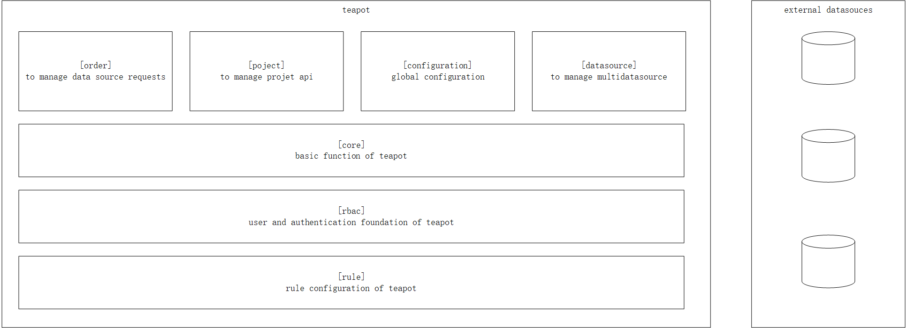

# about this project
teapot is a project that provide api and multi-datasource management


# how to deploy teapot
## deploy teapot server
```
git clone https://github.com/tanzzj/teapot.git
```

then execute 
```
mvn package
```
then DEPLOY the jar to your server

## deploy teapot ui
```
git clone https://github.com/tanzzj/teapot-ui
```
then execute
```
npm install
```
then deploy your resources to APACHE etc.

# to be a contributor 
pls create a pull request